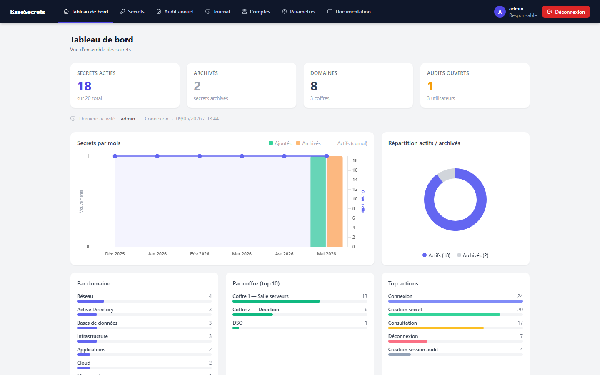
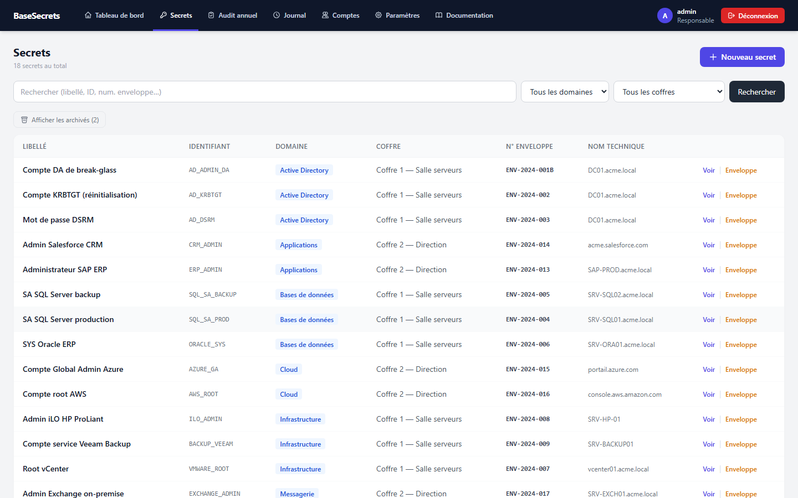
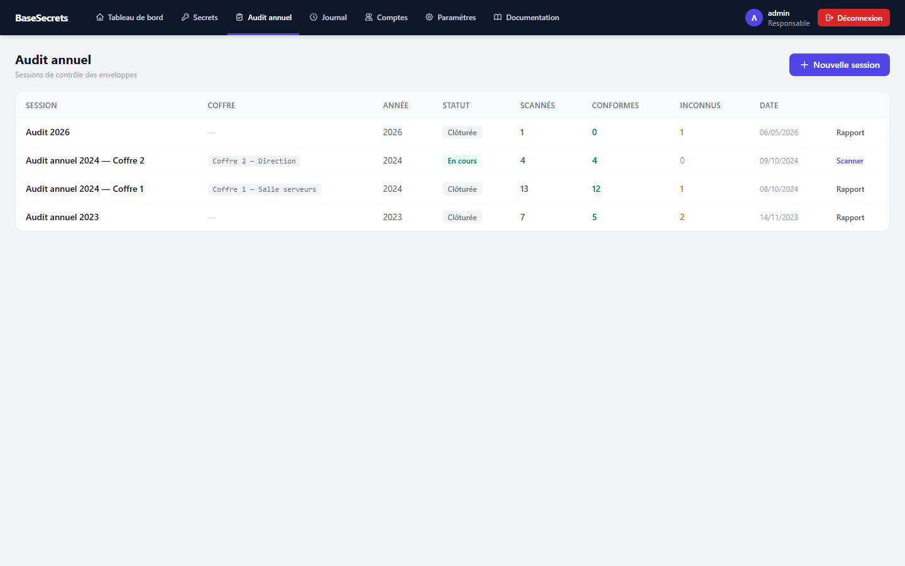
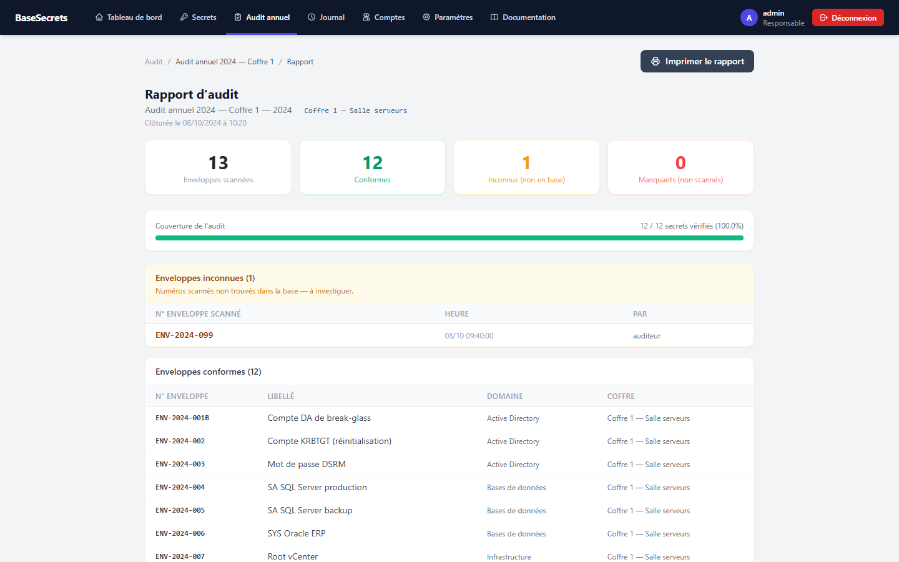
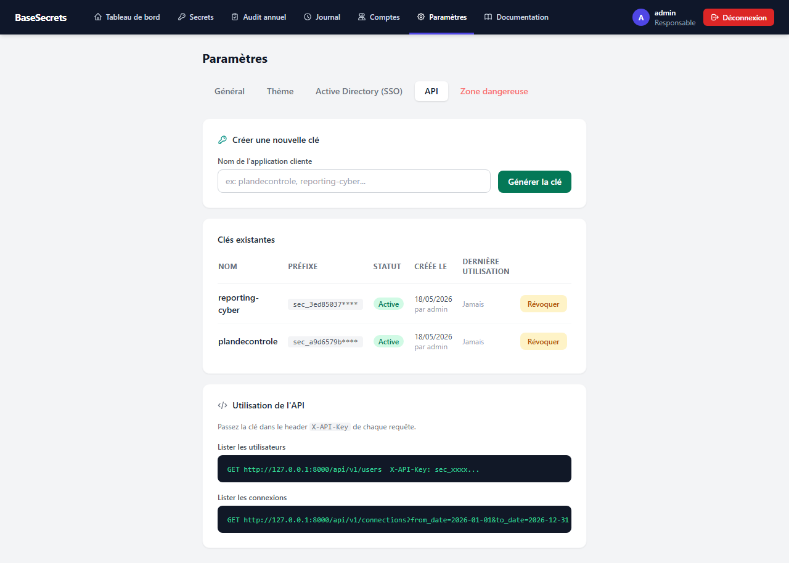
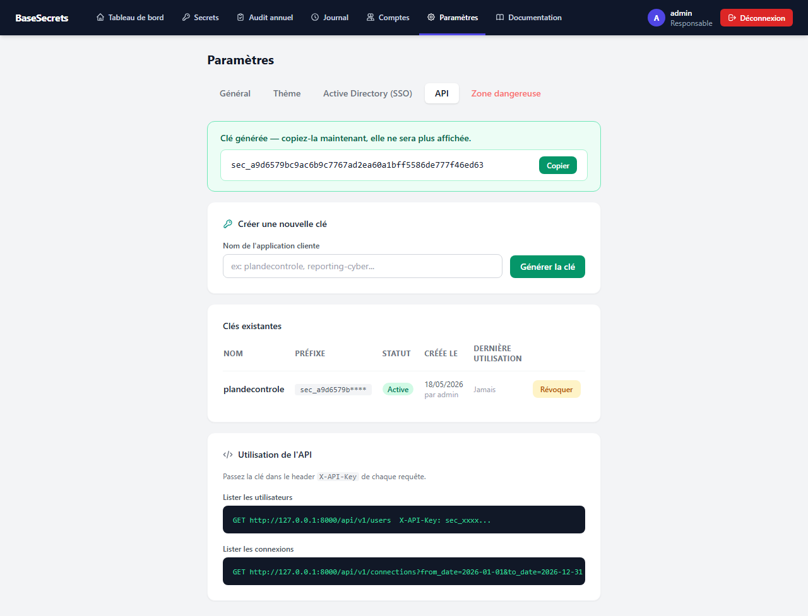

# BaseSecrets


Portail de gestion des secrets d'entreprise (mots de passe, clés d'API, certificats…) stockés dans des enveloppes scellées en coffre-fort.

Déploiement local Windows ou Docker, aucune dépendance cloud.

---

## Aperçu

| Tableau de bord | Liste des secrets |
|---|---|
|  |  |

| Audit annuel | Rapport d'audit |
|---|---|
|  |  |

| Paramètres API — liste des clés | Génération d'une nouvelle clé |
|---|---|
|  |  |

---

## Fonctionnalités

- **Tableau de bord statistique** — vue d'ensemble avec cards (actifs, archivés, domaines, coffres, audits, utilisateurs), graphique mixte secrets/mois (barres ajoutés + archivés + courbe cumul actifs), donut actifs/archivés, top 5 actions, progression des audits en cours, activité récente avec badges colorés
- **Profil utilisateur** — chaque utilisateur peut modifier son prénom, son nom et changer son mot de passe depuis l'avatar en haut à droite (vérification de l'ancien mot de passe requise)
- **Registre des secrets** — référentiel centralisé avec recherche full-text (libellé, identifiant, nom technique, numéro d'enveloppe actuel et anciens numéros)
- **Archivage** — désactiver un secret obsolète sans perdre la traçabilité ; les archivés sont masqués par défaut et exclus des audits
- **Import CSV / Excel** — import en masse depuis un fichier `.csv` ou `.xlsx` avec rapport détaillé (importés / doublons / erreurs)
- **Changement d'enveloppe** — flux dédié avec traçabilité complète : ancien numéro, nouveau numéro, opérateur, date, note optionnelle
- **Audit annuel par coffre** — session de scan en temps réel avec douchette USB ; périmètre limité à un coffre précis ; rapport de conformité imprimable (manquants filtrés par coffre, archivés exclus)
- **Journal d'activité** — toutes les actions tracées (connexions, modifications, audits, imports, archivages) — accès réservé aux responsables
- **Gestion des comptes** — création, modification, suppression avec protection du dernier responsable
- **SSO Active Directory** — authentification LDAP avec restriction par OU et/ou groupe AD ; fallback local ; création automatique des comptes
- **Clés API multi-applications** — gestion de clés API nommées par application cliente (création, révocation, suppression) ; clé affichée une seule fois à la génération ; suivi préfixe + date de dernière utilisation
- **API REST** — `GET /api/v1/users` et `GET /api/v1/connections` sécurisés par header `X-API-Key`
- **Thème couleurs** — personnalisation de la couleur principale (sidebar) et secondaire (boutons/accents) depuis les paramètres
- **Logo société** — personnalisation de la page de connexion
- **Zone dangereuse** — purge totale des secrets avec confirmation par phrase (responsable uniquement)
- **Guide intégré** — accessible sur `/guide` sans authentification

## Rôles

| Action | Auditeur | Responsable |
|---|:---:|:---:|
| Consulter les secrets | ✓ | ✓ |
| Rechercher | ✓ | ✓ |
| Audit annuel + impression rapport | ✓ | ✓ |
| Modifier son profil (nom, prénom, mot de passe) | ✓ | ✓ |
| Journal d'activité | — | ✓ |
| Créer / modifier un secret | — | ✓ |
| Archiver / désarchiver un secret | — | ✓ |
| Importer CSV / Excel | — | ✓ |
| Changer un numéro d'enveloppe | — | ✓ |
| Gérer les comptes | — | ✓ |
| Paramètres (logo, thème, SSO AD) | — | ✓ |
| Gérer les clés API | — | ✓ |
| Purger tous les secrets | — | ✓ |

## Stack technique

- **Backend** : Python 3.10+ · FastAPI · SQLAlchemy 2 · SQLite
- **Frontend** : Jinja2 · Tailwind CSS (CDN) · Alpine.js v3 · Chart.js v4
- **Auth** : sessions Starlette · bcrypt · ldap3 (SSO AD optionnel)
- **Import** : csv (stdlib) · openpyxl (Excel)

## Installation

### Mode classique (Windows / Linux)

**Prérequis** : Python 3.10 ou supérieur, avec `pip` dans le PATH.

```bash
pip install -r requirements.txt
python run.py
```

Ouvrir [http://127.0.0.1:8000](http://127.0.0.1:8000)

### Mode Docker

```bash
docker compose up --build -d
```

L'application écoute sur le port `8000`. Les données sont persistées dans des volumes Docker nommés (`basesecrets_data`, `basesecrets_uploads`).

Pour exposer sur le réseau local, modifier le port dans `docker-compose.yml` :
```yaml
ports:
  - "80:8000"
```

## Comptes par défaut

À changer après la première connexion.

| Compte | Mot de passe | Rôle |
|---|---|---|
| `admin` | `noukie2017` | responsable |
| `auditeur` | `audit123` | auditeur |

## Structure

```
basesecrets/
├── run.py                    # point d'entrée
├── requirements.txt
├── install.txt               # guide d'installation simplifié
├── Dockerfile
├── docker-compose.yml
├── app/
│   ├── main.py
│   ├── models.py             # Secret, SecretHistory, AuditSession, User, ApiKey…
│   ├── auth.py               # bcrypt + LDAP
│   ├── settings_manager.py   # lecture/écriture data/settings.json
│   ├── utils.py
│   ├── routers/
│   │   ├── secrets.py        # CRUD + import CSV/Excel
│   │   ├── audit.py
│   │   ├── activity.py
│   │   ├── users.py
│   │   ├── settings.py       # logo, thème, LDAP, clés API
│   │   └── api_v1.py         # API REST (X-API-Key)
│   └── templates/
│       ├── settings/
│       └── secrets/import.html
├── data/                     # secrets.db + settings.json (générés)
└── uploads/                  # scans enveloppes + logo société
```

## Douchette USB

La douchette fonctionne en mode clavier : aucun pilote requis. Elle tape le numéro d'enveloppe puis envoie `Entrée`. Les pages d'audit, de création de secret et de changement d'enveloppe focalisent automatiquement le champ de saisie.

## Archivage des secrets

Un secret archivé conserve toute sa traçabilité (historique, audits passés) mais n'apparaît plus dans l'inventaire actif ni dans les "manquants" d'un audit futur. Un bouton **Désarchiver** permet de le réactiver. L'accès aux archivés reste possible via le filtre "Afficher les archivés" dans la liste.

## Thème couleurs

Depuis **Paramètres → Thème**, les responsables peuvent personnaliser :
- **Couleur principale** — fond de la sidebar et de la page de connexion (défaut : bleu nuit `#0f172a`)
- **Couleur secondaire** — boutons d'action et élément de navigation actif (défaut : indigo `#4f46e5`)

## API REST

BaseSECRETS expose une API REST sécurisée par clé API, destinée aux outils externes (Plan de Contrôle Cyber, reporting, etc.).

### Gestion des clés

Depuis **Paramètres → API**, les responsables peuvent créer des clés nommées par application cliente. La clé complète est affichée **une seule fois** à la génération — elle doit être copiée immédiatement. Seul le préfixe (`sec_XXXXXXXX****`) est affiché par la suite.

### Endpoints

| Méthode | Endpoint | Description |
|---|---|---|
| `GET` | `/api/v1/users` | Liste des utilisateurs (id, username, prénom, nom, rôle) |
| `GET` | `/api/v1/connections` | Événements de connexion, filtrable par `from_date` / `to_date` (YYYY-MM-DD) |

### Authentification

Passez la clé dans le header `X-API-Key` de chaque requête :

```
GET http://127.0.0.1:8000/api/v1/users
X-API-Key: sec_xxxxxxxxxxxx...
```

## Zone dangereuse

Depuis **Paramètres → Zone dangereuse**, les responsables peuvent purger la totalité des secrets (secrets, historique, sessions d'audit). Une confirmation par saisie de la phrase exacte `je supprime tous les secrets` est exigée avant exécution. L'action est irréversible.

## Scripts de démonstration

Deux scripts utilitaires à la racine du projet :

```bash
# Charger des données fictives réalistes (screenshots, démonstration)
python demo_populate.py

# Remettre la base à zéro (base vierge + comptes par défaut uniquement)
python demo_reset.py
```

`demo_populate.py` insère 18 secrets actifs répartis sur 2 coffres, 1 secret archivé, 3 sessions d'audit (dont une en cours) et un historique de changement d'enveloppe. Ces données ne sont jamais incluses dans le dépôt (`data/` est dans `.gitignore`).

## Licence

Distribué sous licence [MIT](LICENSE) — libre d'utilisation, de modification et de redistribution.
